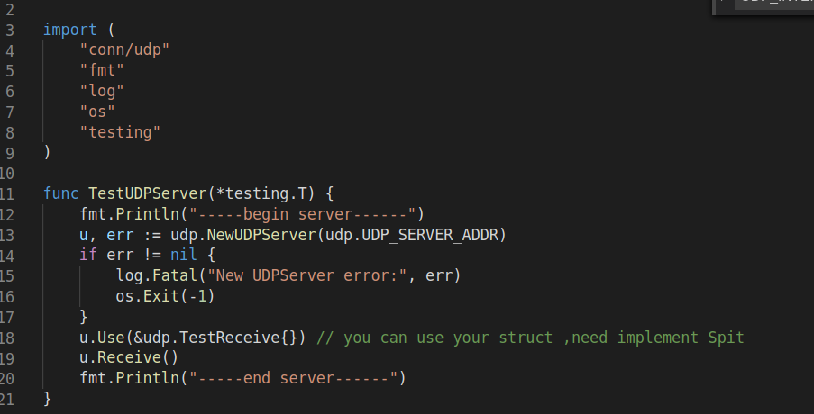
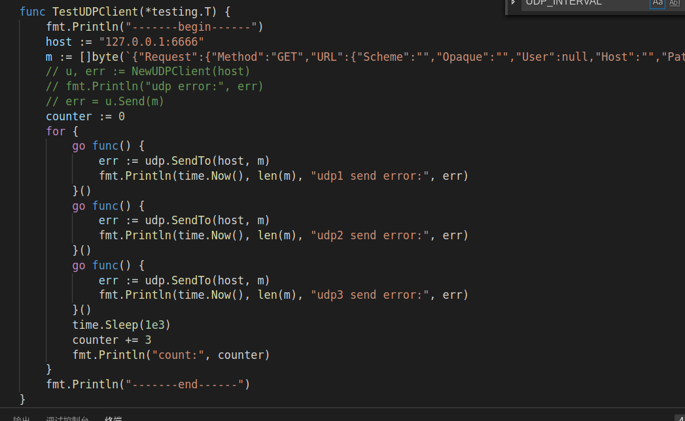

## golang udp

## usage 
1. go get -u github.com/bugfan/conn/udp
2. udp.NewUDPServer("host:port").Receive()
3. udp.NewUDPClient("host:port").Send(data)

## see server and client  test file 
1. server test code

2. client test code
