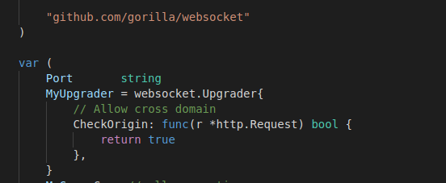
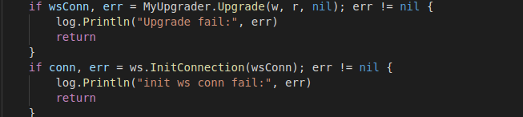
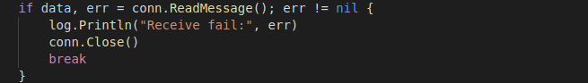
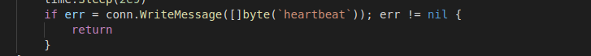
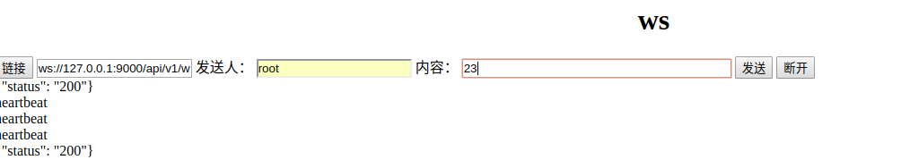
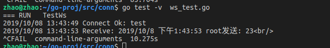

## Golang Websocket

## usage 
1. go get -u github.com/bugfan/conn/ws

## 参阅`github.com/bugfan/conn`目录下面的`ws_tes.go`和`ws_client_test.html` 代码 
## Websocket使用步骤
1. 生成Upgrade

2. 使用Upgrader生成链接 并设法保存(案例使用map保存,便于查找)

3. 接收消息

4. 发送消息

5. 客户端界面显示

6. 服务器端控制抬输出

